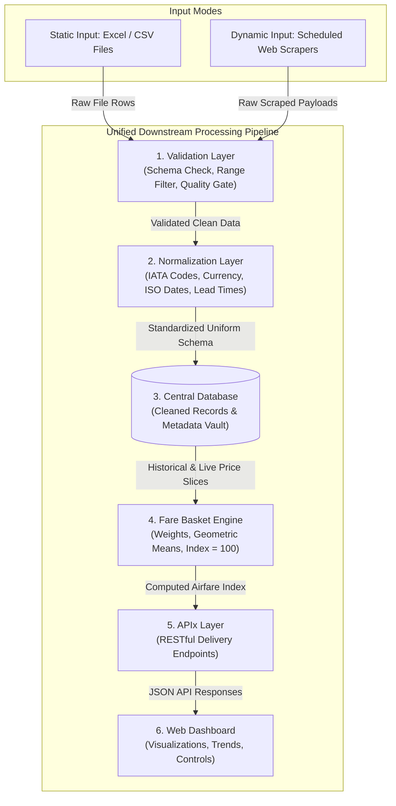

# System Architecture: Real-time Airfare Price Index (SIH26056)

## 1. High-Level Architecture Overview

The system is built on a **Convergent Dual-Input Architecture**. It ingests airfare data from two distinct channels—**Static (Excel/CSV files)** and **Dynamic (Automated Web Scrapers)**—and channels both immediately into a **single, unified downstream processing pipeline**.

This design ensures 100% data consistency: regardless of whether a price was read from an offline government spreadsheet or captured live from an airline website, it undergoes identical validation, normalization, storage, and statistical index calculation.

```
+---------------------------------------------------------------------------------------------------+
|                                      DUAL INGESTION MODES                                         |
+---------------------------------------------------------------------------------------------------+
|                                                                                                   |
|  [ STATIC MODE ]                                               [ DYNAMIC MODE ]                   |
|  Offline Excel / CSV Files                                     Automated Web Scrapers             |
|  (Historical / Batch Dumps)                                    (Airlines & OTAs)                  |
|            |                                                               |                      |
|            +----------------------------+  +-------------------------------+                      |
|                                         |  |                                                      |
+-----------------------------------------|--|------------------------------------------------------+
                                          v  v
+---------------------------------------------------------------------------------------------------+
|                                 UNIFIED DOWNSTREAM PIPELINE                                       |
+---------------------------------------------------------------------------------------------------+
|                                                                                                   |
|  1. VALIDATION LAYER                                                                              |
|     * Schema verification                                                                         |
|     * Range checks & anomaly rejection                                                            |
|     * Missing field handling                                                                      |
|                                           |                                                       |
|                                           v                                                       |
|  2. NORMALIZATION LAYER                                                                           |
|     * ISO-8601 timestamps                                                                         |
|     * Currency conversion to INR                                                                  |
|     * IATA airport code standardization                                                           |
|     * Advance purchase lead-time computation (T-1, T-7, T-30)                                     |
|                                           |                                                       |
|                                           v                                                       |
|  3. CENTRAL DATABASE                                                                              |
|     * Unified flight records table                                                                |
|     * Route master & airport metadata                                                             |
|     * Scraper & batch audit logs                                                                  |
|                                           |                                                       |
|                                           v                                                       |
|  4. FARE BASKET ENGINE                                                                            |
|     * Route passenger volume weighting (Metro vs Regional)                                        |
|     * Lead-time grouping & geometric price aggregation                                            |
|     * Base Period indexing (Index = 100 benchmark)                                               |
|                                           |                                                       |
|                                           v                                                       |
|  5. APIx (DELIVERY & AGGREGATION LAYER)                                                           |
|     * REST API endpoints for MoSPI central systems                                                |
|     * Real-time query engine for route and index trends                                           |
|                                           |                                                       |
|                                           v                                                       |
|  6. ANALYTICAL DASHBOARD                                                                          |
|     * Interactive charts, CPI augmentation metrics, and route maps                                |
|     * Drag-and-drop CSV upload and manual scraper triggers                                        |
|                                                                                                   |
+---------------------------------------------------------------------------------------------------+
```

---

## 2. Pipeline Flow Diagram (Mermaid)



---

## 3. Beginner-Friendly Component Breakdown

Below is an explanation of every component in plain, simple English—what it is, what real-world problem it solves, and how it works.

---

### Component 1: Static Ingestion (Excel/CSV Parser)
* **What is it?** A file reader module that accepts spreadsheets (`.csv`, `.xlsx`) uploaded by human analysts.
* **Why do we need it?** Government organizations like MoSPI or the Directorate General of Civil Aviation (DGCA) already possess vast amounts of historical fare records, airline filings, and offline surveys stored in Excel files. This module allows those records to be fed directly into the system.
* **How it works:** When a user uploads a file through the dashboard, this module parses the tabular data row-by-row and hands it off to the validation layer.

---

### Component 2: Dynamic Ingestion (Web Scraper Worker)
* **What is it?** An automated bot program that visits airline websites (e.g., IndiGo, Air India) and Online Travel Aggregators (e.g., MakeMyTrip, EaseMyTrip) at set schedules (e.g., every 6 hours) to collect real-time ticket prices.
* **Why do we need it?** Flight prices change constantly due to demand, time of day, and seat availability. Humans cannot manually check thousands of flights every hour. The scraper automates this round the clock.
* **How it works:** The scraper sends search queries for specific routes (like Delhi to Mumbai) for various future dates ($T-1$, $T-7$, $T-30$ days), extracts the airline name, flight number, departure time, and total fare, and passes this raw payload to the validation layer.

---

### Component 3: Validation Layer (The Quality Bouncer)
* **What is it?** A strict inspection checkpoint that tests every single incoming record to ensure it is healthy and valid.
* **Why do we need it?** Web scraping occasionally extracts broken HTML, and user-uploaded Excel sheets often have typos, empty cells, or negative numbers. If bad data enters the database, it ruins the national inflation calculation.
* **How it works:** The validator checks each record against clear rules:
  1. *Is the price a positive number?* (e.g., Reject price $\le 0$).
  2. *Are the origin and destination valid airport codes?* (e.g., `DEL`, `BOM`, `BLR`).
  3. *Is the departure date in the future?*
  4. *Are mandatory fields present?* (airline, route, fare, departure timestamp).
  Records passing inspection continue to Normalization; failed records are logged in an error table for review.

---

### Component 4: Normalization Layer (The Universal Translator)
* **What is it?** A formatting engine that converts diverse, messy data into one single standard format.
* **Why do we need it?** Different websites and spreadsheets write things differently. One website might write `"15-Aug-2026 14:30"`, another writes `"2026/08/15 2:30 PM"`, and an Excel file might write `"15/08/2026"`. Similarly, one source might say `"IndiGo"`, another `"6E"`, and another `"Indigo Airlines"`.
* **How it works:** 
  - Standardizes all timestamps to standard ISO-8601 (`2026-08-15T14:30:00Z`).
  - Standardizes carrier names to canonical names and codes (`6E` $\rightarrow$ `IndiGo`).
  - Standardizes currencies to Indian Rupees (INR).
  - Calculates the **Lead Time** ($T = \text{Departure Date} - \text{Observation Date}$).

---

### Component 5: Central Database (The Data Vault)
* **What is it?** A reliable relational database (such as PostgreSQL or SQLite) that stores all clean flight prices, airport details, routes, and computed indices.
* **Why do we need it?** It acts as the single source of truth for the entire application, enabling fast searching, historical comparisons across months/years, and secure data storage.
* **How it works:** Stores data in well-structured tables:
  - `flight_prices`: Individual flight records with timestamps, fares, airline, and route.
  - `routes`: Master list of monitored routes, airport codes, and passenger traffic weights.
  - `fare_indices`: Time-series records of calculated index values.
  - `ingestion_logs`: Audit trail tracking every CSV upload and scraper run.

---

### Component 6: Fare Basket Engine (The Economic Index Calculator)
* **What is it?** The core mathematical and statistical engine that turns thousands of individual flight prices into a single meaningful **Airfare Price Index**.
* **Why do we need it?** Raw flight prices cannot directly measure national inflation because some routes have millions of passengers (like Delhi-Mumbai) while others have fewer (like Delhi-Dharamshala). Also, a ticket bought 1 day before departure costs much more than one bought 30 days before.
* **How it works:**
  1. It groups prices into a representative "basket" across key route categories and booking windows ($T-1$, $T-3$, $T-7$, $T-14$, $T-30$).
  2. It calculates the geometric mean price for each route bucket.
  3. It applies traffic weights (based on passenger volume) and compares the current weighted average to the Base Period ($Base = 100$) to yield the **Real-time Airfare Index**.

---

### Component 7: API Layer (`APIx` - The Delivery Counter)
* **What is it?** A fast RESTful API web service that serves data to anyone who requests it in standard JSON format.
* **Why do we need it?** The National Statistical Office (NSO) and MoSPI need to pull real-time airfare index data directly into their overarching national Consumer Price Index (CPI) computing systems without human intervention.
* **How it works:** Provides documented web endpoints:
  - `GET /api/v1/index/current`: Returns the latest overall national airfare price index.
  - `GET /api/v1/index/history`: Returns historical index movements and percentage inflation.
  - `GET /api/v1/routes`: Returns route-by-route price and index breakdowns.
  - `POST /api/v1/upload`: Programmatic endpoint for uploading static CSV/Excel feeds.

---

### Component 8: Analytical Dashboard (The Visual Control Deck)
* **What is it?** A clean, modern web application running in the browser for MoSPI officers and data analysts.
* **Why do we need it?** People understand charts, graphs, and trends much better than raw rows of numbers.
* **How it works:**
  - Connects to `APIx` to fetch and render interactive charts (index trends, inflation trajectory).
  - Displays route heatmaps and pricing comparisons between airlines.
  - Offers a drag-and-drop box to upload new Excel/CSV files with instant feedback.
  - Displays system health, scraper status, and data freshness indicators.

---

## 4. Architectural Philosophy: Why No Microservice Overhead?

> [!TIP]
> **Pragmatic Architectural Decision**:
> In hackathons and real-world statistical prototypes, deploying dozens of microservices, Kubernetes clusters, and message queues (like Kafka or RabbitMQ) introduces massive failure points, networking overhead, and deployment complexity without adding real value.

We utilize a **Modular Monolith** architecture:
1. **Single Cohesive Backend**: All layers (Validator, Normalizer, DB ORM, Fare Basket Engine, APIx) live inside a well-structured Python/FastAPI application.
2. **Clear Internal Boundaries**: Modules communicate via clean Python function calls and shared database models rather than unreliable internal network hops.
3. **Single Portable Database**: A single relational database (PostgreSQL or SQLite) handles structured records and historical queries with zero synchronicity lag.
4. **Lightweight Decoupled Frontend**: A modern, single-page application (React / Tailwind) interacts cleanly with the backend via REST endpoints.
